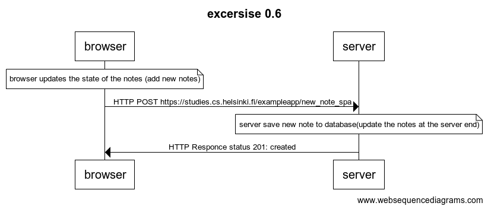

    title excersise 0.6

    note over browser:
    browser updates the state of the notes (add new notes)
    end note

    browser->server: HTTP POST https://studies.cs.helsinki.fi/exampleapp/new_note_spa

    note over server:
    server save new note to database(update the notes at the server end)
    end note 

    server->browser: HTTP Responce status 201: created
